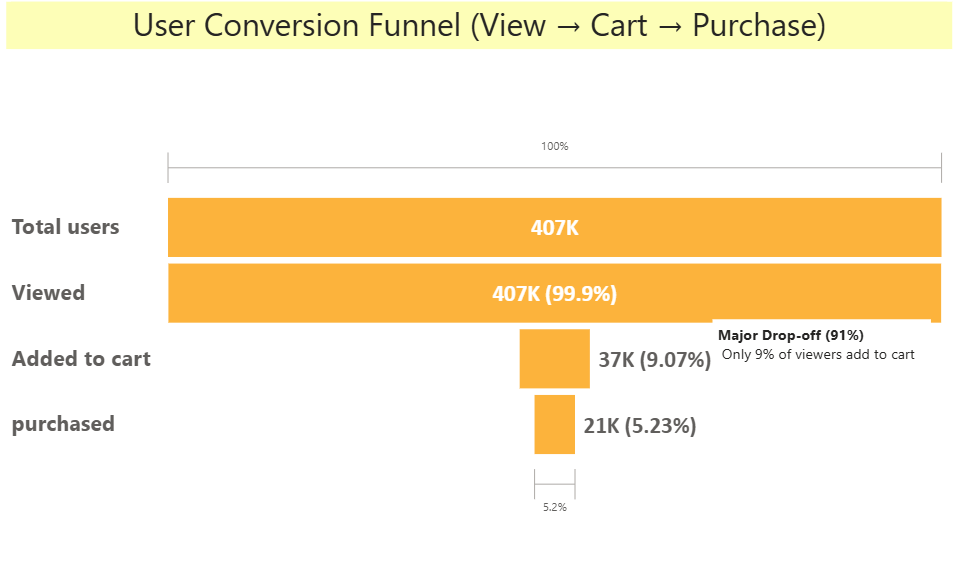
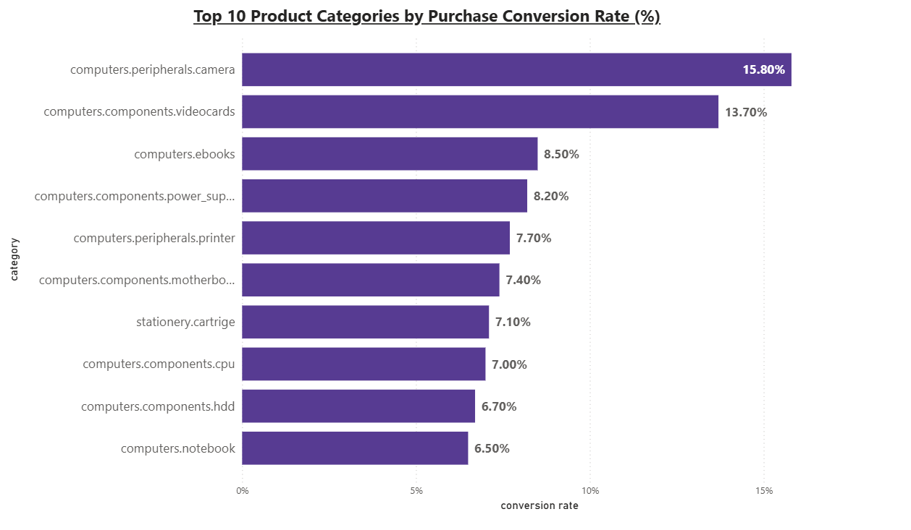
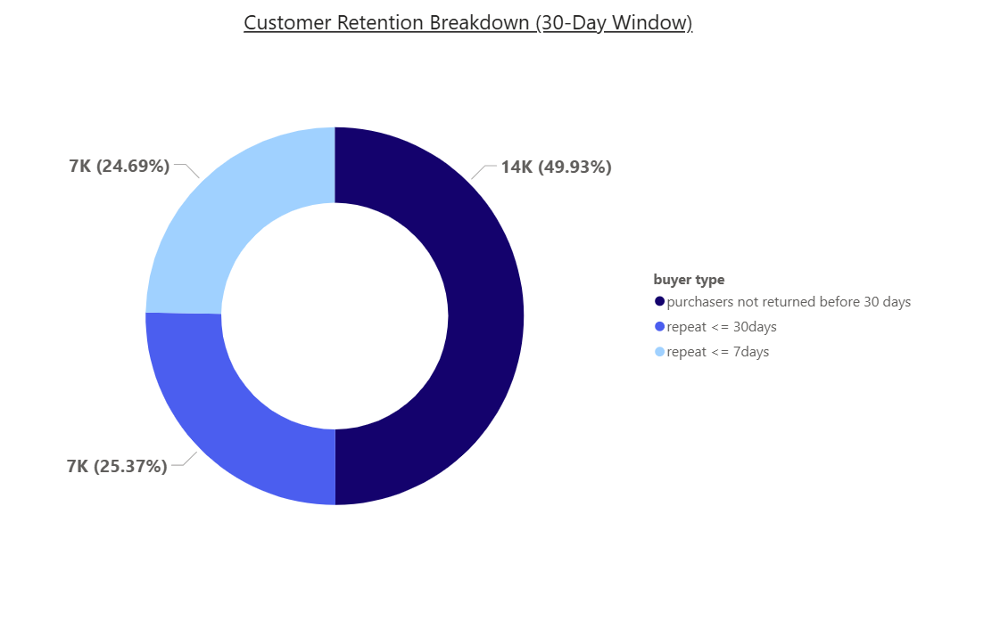

# 🛒 E-commerce Funnel & Retention Analysis (SQL)

## 📌 Project Overview
This project analyzes **user behavior on an e-commerce platform** using event-level data to understand how users move from product views to purchases, identify where major drop-offs occur, and evaluate short-term customer retention after the first purchase.

The analysis focuses on:
- Conversion funnel efficiency  
- Product category-level conversion behavior  
- Short-term customer retention (7-day and 30-day)

All analysis was performed using **SQL**, with results visualized in **Power BI**.

---

## 🎯 Project Objective
To analyze user behavior in an e-commerce platform by evaluating the conversion funnel, identifying category-level purchase patterns, and measuring short-term customer retention, in order to uncover key drop-off points and actionable opportunities to improve conversions and early repeat purchases.

---

## 📂 Dataset
- **Source:** Public e-commerce event dataset  
- **Granularity:** Event-level (view, cart, purchase)
- **Key Fields:**  
  `user_id`, `event_time`, `event_type`, `product_id`, `category_code`, `price`, `user_session`

---

## 🛠 Tools & Technologies
- **SQL Server** – data cleaning, transformation, and analysis  
- **Power BI** – visualization and dashboarding  
- **GitHub** – version control and project documentation  

---
## 🧹 Data Cleaning & Preparation
The following steps were performed using SQL:
- Removed duplicate event records using window functions
- Converted event timestamps into SQL datetime format
- Handled missing values (notably in category fields)
- Created a cleaned events table for downstream analysis

---

## 🔍 Analysis Performed

### 1️⃣ Conversion Funnel Analysis
Analyzed how users progress through key funnel stages at two levels:

**Level 1: Overall Funnel**
- Product View
- Add to Cart
- Purchase

Metrics calculated:
- Funnel counts at each stage
- Conversion rates between stages
- Absolute drop-off volumes between stages

This level helped identify where the largest user drop-off occurs in the overall journey.

**Level 2: Funnel Deep-Dive**
To better understand user behavior within the funnel, additional breakdowns were performed:
- Hour-of-day analysis of views and purchases to observe intra-day activity patterns
- Product category-level funnel performance to compare high- vs low-converting categories
- Time-to-purchase analysis to estimate decision latency between first view and first purchase

This analysis helps explain aggregate funnel drop-offs.

---

### 2️⃣ Customer Retention Analysis
Measured short-term repeat purchase behavior:
- Identified first purchase date per user
- Calculated repeat purchases within:
  - 7 days
  - 30 days
- Derived retention rates within the observed time window

This analysis focuses on **early retention**, not lifetime loyalty.

---

## 📊 Key Visualizations

### User Conversion Funnel

### Top Product Categories by Purchase Conversion Rate

### Customer Retention Breakdown (7-Day vs 30-Day)

---

## 📈 Key Insights
- The **largest user drop-off occurs before the cart stage**, with only ~9% of viewers adding items to cart.
- Once users add items to cart, **conversion to purchase is strong (~58%)**, indicating an efficient checkout flow.
- Product categories show **significant variation in conversion rates**, with accessories and components converting better than high-involvement products.
- Average time to purchase is approximately **37 hours**, suggesting comparison-driven decision-making.
- **Short-term retention is time-sensitive**:
  - ~33% of buyers return within 7 days.
  - Very limited additional repeat behavior occurs between days 8–30.

---

## 💡 Business Recommendations
- Improve **pre-cart engagement** (product content, comparisons, trust signals) to reduce early funnel drop-offs.
- Focus on **early post-purchase engagement within the first 7 days** to increase repeat purchases.
- Use category-level insights to:
  - Promote high-conversion accessories alongside high-involvement products
  - Tailor product page experiences based on purchase intent

---
## 📊 Project Presentation

A detailed walkthrough of the analysis, visuals, and business insights is available in the presentation below:

📄 **[Download Project Presentation (PDF)](presentation/ecommerce_analysis.pdf)**

## 📑 Project Assets
- SQL scripts: `/sql`
- Dataset: `/data`
- Visualizations: `/visuals`
- Presentation summary: `/presentation`

---

## 📌 Notes
- All insights are based on the available data and defined observation windows.
- The analysis does not assume user location, time zone, or marketing attribution.

